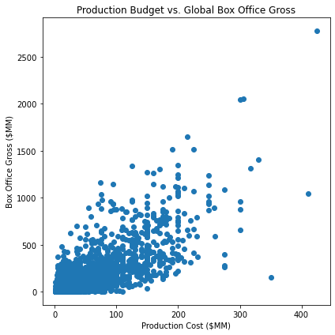
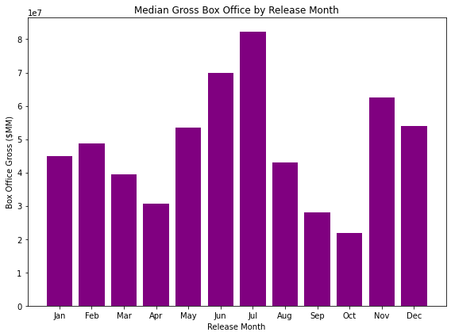
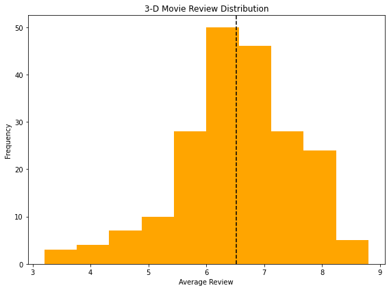
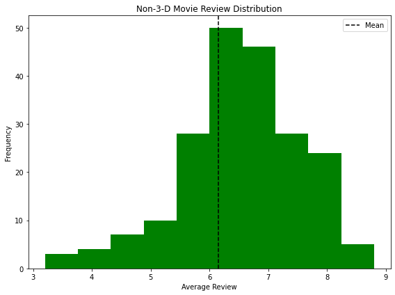

# Microsoft Project Blockbuster

**Author:** Brendan M. Whittington

# Overview

This project analyzes movie box office grosses and viewer reviews to assess the basic strategy Microsoft should consider in the type of movies and timing it should employ as part of a potential foray into the movie industry.

# Business Problem

Microsoft needs to have a better understanding around the potential production investments it needs to make in order to see a box office success. Furthermore, making a "good" movie is not enough it needs to be released at an appropriate time of the year to recoup the investments. Finally, do audiences actually rate 3-D movies higher for it to warrant making these costlier movies.

# Data

The data utilized comes from IMDB and The Numbers two noteable collectors of movie data. The data of interest included information on thousands of movies' release dates, production costs, availability in 3-D and ratings. 

# Methods

The analysis used descriptive charts to visualize the median gross by release month, a scatter blot and correlation calculation between productions costs and box office gross, and histogram and mean comparison for 3-D versus regular movie ratings.

# Results

There is a strong correlation of 0.77 between production budgets and the gross box office budget.

There is strong seasonality in the movie release months. July is by far the most successful month whereas October is the worst. It would appear to be related to the summer season when people are on holiday and in the winter when people have holidays and fmaily gatherings.

The average movie that also has a 3-D release scores marginally higher than movies without the 3-D option.

# Conclusion

Movies with larger budgets due tend to make more money than smaller ones which elevates the risk of making the movie in the first place. Movies show strong seasonality and the time of the release should not be made at random. Finally, it appears there is marginally higher appeal toward 3-D movies and to the extent it can translate into a higher box office gross is a medium worth further exploring.

$Next Steps:$

1.) How does including the marketing budget in the total costs translate into the returns on investments for a movie? Is "bigger still better"?

2.) What are the returns on investments by month of release? There may be opportunities to release movies in less competitive months.

3.) Do 3-D movies actually result in higher audience appeal when comparing the same movie? Do people actually rate the same movie higher if there is a 3-D option or is it possible that 3-D movies are only a fad? How much more money can one expect to make with a 3-D movie?
